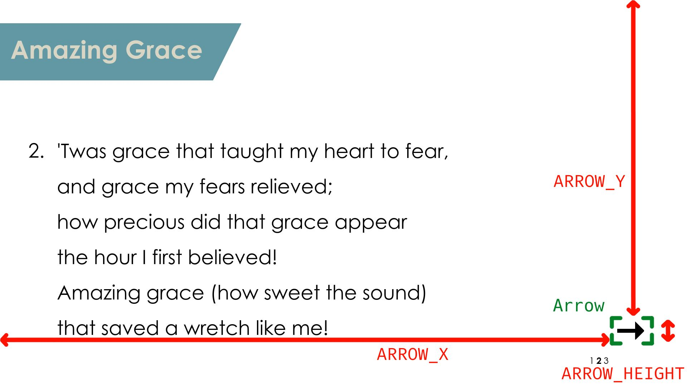

# slidegen

As the name may partially imply, **`slidegen.py`** generates song slides as images - out of a plain text input file - intended for use with [OBS](https://obsproject.com/) to livestream a typical (contemporary) Sunday church service.

This program is also intended to be used in conjunction with **`ssync.py`**, which is basically a wrapper script that automatically syncs a local copy with the remote slide repository, removes the old obs slides and lets the user interactively choose the new slides with a smart fuzzy finder. It stands for slidesync, by the way.

Standalone use of **`slidegen.py`** is possible and can sure fit other use cases.

## Why this program exists

To add song slides to OBS or similar software as input sources, there exist the following obvious options:

- generating song slides via a text or presentation documents, exported in printable form and converted to images afterwards
- generating images through image manipulation or designing software and export to images

Both of these processes have *major downsides*: They are hard to automate, take a long time to create the slides, have very limited to support for bulk operations on the song repository (like wanting to change the theme and layout of all slides or changing the metadata shared by a lot of songs) and maintaining is a lot harder because of bad portability and complex source files.

The only upside they have is that can be more intuitive for inexperienced computer users, but changing a text file template and uploading to a remote storage should not be too hard to manage and worth it as it has *none* of the above mentioned downsides.

## Usage

### Commandline Interface
As mentioned above, this program is not made to be executed directly. Therefore the commandline interface is not yet fully stable. Generally, the syntax is as follows

    ./slidegen.py SRC_PATH DEST_DIR PROMPT_INPUT

with `SRC_PATH` being the path to the song plain text file, `DEST_DIR` the output directory where the slide image file output is placed and `PROMPT_INPUT`

Here a short example:

    ./slidegen.py "../songrepo/Stille Nacht.txt" "~/Documents/Song Slides 1"

The wrapper script does have two optional arguments, which are usually not needed. One is disables the syncing with the remote and to other disables the asynchronous slide generation, ut check out the help page as shown down below. To execute normally, use

    ./ssync.py

and to show the help page for both programs use `-h` or `--help` interchangeably like this:

    ./ssync.py -h
    ./slidegen.py --help

### Source File Layout

The file is divided into two what we will here call *parts* that are divided with at least one `\n` character and an arbitrary amount of lines that are either empty or only contain whitespace:
- the metadata header (top of the file)
- the text body (bottom of the file)

#### 1. Part: The Metadata Header

As the top of the file are these five metadata entries. We call them *metadata strings*:
- title
- book
- text
- melody
- structure

As for the syntax, each line starts with the metadata string, followed by *": "*, and ends with a non-empty string that acts as the value of the metadata string, which we call *metadata value*.  The `structure` is allowed only `R` and non-negative integers values separated by one comma each, which represents the structure or order in which to song is to be played by dividing the song into refrain and verses. The values in between the commas are called *structure elements*.

Hence to check if a line in the header has the correct syntax use the following regular expression: `^(?!structure)\S+: .+|^structure: ([0-9]+|R)(,([0-9]+|R))*$`. What is not captured syntactically by this regex is that each metadata string and value pair must appear *exactly once* in the header.

The semantics of the other metadata values can be pretty much whatever you want, as long as they adhere to the syntax. Note also that the arrangement of lines doesn't have to match the list above, e.g. the line with the book metadata string can be above the line containing the title metadata, but note that it is probably better to not mix this up anyway for quicker manual editing's sake.

Example of a metadata header:

    title: Amazing Grace
    book: Pretty much every protestant songbook
    text: John Newton (1779)
    melody: American folk tune
    structure: 1,2,3

#### 2. Part: The Text Body

To start off with the syntax, every unique structure element, will be placed on a separate line between an opening square bracket directly to the left and an closing square bracket directly to the right, e.g. `[R]` or `[3]`. We call these lines *structure element identifiers*. After each of those lines must follow a finite amount of lines that semantically carry the song text of the corresponding refrain or verse indicated by the structure element. The lines which are empty or only contain whitespace after the last line that doesn't meet these two requirements before either the next structure element identifier or the end of the file are *ignored*, while the lines that are empty or only contain whitespace before that last line who doesn't meet these two requirements are *not ignored*, as they semantically could act as separators intended by the user. Note that such ignored lines are not syntactically necessary, but are heavily encouraged for their clearer separation they provide semantically.

Here is a example of a text body using the first three verses of *'Amazing Grace'* written by John Newton found on [Hymnary.org](https://hymnary.org/text/amazing_grace_how_sweet_the_sound):

    [1]
    Amazing grace (how sweet the sound)
    that saved a wretch like me!
    I once was lost, but now am found,
    was blind, but now I see.

    [2]
    'Twas grace that taught my heart to fear,
    and grace my fears relieved;
    how precious did that grace appear
    the hour I first believed!

    [3]
    Through many dangers, toils and snares
    I have already come:
    'tis grace has brought me safe thus far,
    and grace will lead me home.

### Configuration

The configuration of both `slidegen.py` and `ssync.py` is handled via constants in `*.py` files. The default configuration is stored in `config/default_config.py`, and in the same form a custom user-defined configuration can optionally - except for `ssync.py` which needs user-defined variables -  be placed in `config/config.py`. You don't have to specify all the constants present in the default config, only the one's you want to change.

For example, if you want to change the text color to green and the file extension to "jpeg", your `config/config.py` could look like this:

```python
TEXT_COLOR = "green"
FILE_EXTENSION = "jpeg"
```

Note that directories constants support environment variables in the form `$var` and `${var}` and the `~` user expansion. Also you can always use relative paths, so you don't really need to always enter the full absolute path. For example you could do something like this:

```python
OBS_SLIDES_DIR = "~/Documents/obs-${OBS_MAJOR_VERSION}/slides$month$weekday"
```

Also note that if you enter unsensible configuration entries, that the program may crash as there is basically no config validation except for something like directories.

Now for explanation of the individual entries.

#### File Format and Naming

`IMAGE_FORMAT` forces a specific file format when writing the files in formats accepted by ImageMagick. The individual slides get named in this form: `${FILE_NAMEING}${SLIDE_NUMBER}${FILE_EXTENSION}`. Hence with the default config of

```python
IMAGE_FORMAT = "jpeg"
FILE_EXTENSION = "jpg"
FILE_NAMEING = "slide-"
```

the slides would be named `slide-1.jpg`, `slide-2.jpg`, `slide-3.jpg` etc.

#### Dimensions

`WIDTH` and `HEIGHT` present the output resolution of the slide in pixels. Meaning for 4K slides you would have to use

```python
WIDTH = 3840
HEIGHT = 2160
```

#### General Colors

Now let us look at the start slide. With `BG_COLOR` we can set the background for all slides and `FG_COLOR` sets the color of the what we call *titlebar*. Note the color values are again in the typical form accepted by ImageMagick.

```python
BG_COLOR = "white"
FG_COLOR = "#6298a4"
```


#### Titlebar

```python
TITLE_COLOR = "#d8d5c4"
MAX_TITLE_FONT_SIZE = 70
MIN_TITLE_FONT_SIZE = 20
TITLE_FONT_SIZE_STEP = 10
TITLE_HEIGHT = 160
TITLEBAR_Y = 65
TITLEBAR_TRIANGLE_WIDTH = 80
TITLEBAR_TRIANGLE_HEIGTH = 160
```

Both `TITLEBAR_Y` and `TITLE_HEIGHT` are transformations given in pixels as shown in the following image. THE `TITLE_COLOR` gives a color of the song title (in this example, *"Amazing Grace"*) in the accepted color format of ImageMagick, same for the font sizes. More in detail, the `MAX_TITLE_FONT_SIZE` is applied when the song title is not too long, but when is the case, slidegen automatically shrinks down the font size in steps of `TITLE_FONT_SIZE_STEP` until it reaches the minimum font size specified by `MIN_TITLE_FONT_SIZE`. The dimensions of the triangle on the right of the titlebar can be give in pixel as the height by `TITLEBAR_TRIANGLE_HEIGTH` and as the width by `TITLEBAR_TRIANGLE_WIDTH`.


#### Infodisplay

```python
INFODISPLAY_FONT_SIZE = 25
INFODISPLAY_ITEM_WIDTH = 20
INFODISPLAY_X = 1650
INFODISPLAY_Y = 1000
```

`INFODISPLAY_X` and `INFODISPLAY_Y` are the coordinates given as pixels which define where the top-left pixel of the infodisplay is located on the song slides. `INFODISPLAY_FONT_SIZE` just gives the font size in a format acceptable by ImageMagick. Closely related, `INFODISPLAY_ITEM_WIDTH` gives the width in pixels of both the letter of a structure element in the infodisplay and the whitespace that follows before the next structure to the right.


#### Player

```python
PLAYER_WIDTH = 560
PLAYER_HEIGHT = 315
```

The player is intended to be another OBS video source that displays someone or multiple people playing their instruments while the song is playing. The player is anchored on the top right of the slides. In pixels, you can change the dimensions of the player by width via `PLAYER_WIDTH` and by height via `PLAYER_HEIGHT`.

This is so that when the text width on maximum font size collides with the player, the font size is gradually decreased - once again only down to the defined minimum font size - until there is no overlap anymore. Hence if you don't intend to use a player just set the dimensions to 0.


#### Font Configuration

Slidegen uses two font styles, *normal* and *bold*. `BOLD_FONT_PATH` should point the respecting ttf/otf file for the bold style font and `FONT_PATH` for the normal style font. `FONT` and `BOLD_FONT` should be defined as the name of the font as accepted by ImageMagick. This is as some submodules for ImageMagick - or at least their wand python bindings - cannot reliably convert between name and path of the font and has sometimes problems accessing the system font config. Hence we use these four variables. The default config

```python
BOLD_FONT_PATH = "/usr/share/fonts/TTF/century-gothic/CenturyGothicBold.ttf"
FONT_PATH = "/usr/share/fonts/TTF/century-gothic/CenturyGothic.ttf"
FONT = "Century-Gothic"
BOLD_FONT = "Century-Gothic-Bold"
```

is made to use the [ttf-century-gothic](https://aur.archlinux.org/packages/ttf-century-gothic) font on the AUR on Arch Linux (-based distros). For different operating systems you may need to use another naming convention for `FONT` and `FONT_BOLD` like using spaces instead of dashes, but check out the ImageMagick documentation for more details.

#### Metadata

```python
METADATA_FONT_SIZE = 36
METADATA_X = 70
METADATA_VALUE_CHAR_LIMIT = 100
BOOK_Y = 260
ATTRIBUTIONS_Y = 930
```

You can change the font size off the three metadata lines with an acceptable format by ImageMagick using `METADATA_FONT_SIZE`. The metadata is separated into two block on the start slide: The top part contains the book info and the bottom part contains the attributions. You can set the top part placement in pixels with `BOOK_Y` and the respecting bottom part with `ATTRIBUTIONS_Y`. You can also set the maximum character limit of these metadata lines with `METADATA_VALUE_CHAR_LIMIT`.


#### Text Canvas

```python
STRUCTURE_ELEMENT_X = 80
STRUCTURE_ELEMENT_Y = 400
```

On the top left of the Text Canvas, there is a indicator for the structure element of the current slide. The structure element is followed by a dot. Note that the chorus or R is not displayed. You can control the placement in pixels with its X coordinate with `STRUCTURE_ELEMENT_X` and its Y coordinate with `STRUCTURE_ELEMENT_Y`.

```python
TEXT_CANVAS_X = 160
TEXT_CANVAS_Y = 400
TEXT_CANVAS_WIDTH = 1600
TEXT_CANVAS_HEIGHT = 600
```

The Text canvas placement is defined in pixels with its coordinates via `TEXT_CANVAS_X` and `TEXT_CANVAS_Y`. Also in pixels are the dimensions in width with `TEXT_CANVAS_WIDTH` and height with `TEXT_CANVAS_HEIGHT`.

```python
STRUCTURE_ELEMENT_PER_LINE_CHAR_LIMIT = 85
STRUCTURE_ELEMENT_MAX_LINES = 8
MAX_CANVAS_FONT_SIZE = 55
MIN_CANVAS_FONT_SIZE = 35
CANVAS_FONT_SIZE_STEP = 5
INTERLINE_SPACING = 30
```

The character limit of each line is defined with `STRUCTURE_ELEMENT_PER_LINE_CHAR_LIMIT`. The maximum number of lines is set by `STRUCTURE_ELEMENT_MAX_LINES`. Now all the following variables in this paragraph are defined in a format accepted by ImageMagick. `MAX_CANVAS_FONT_SIZE` sets the maximum font size in the text canvas, that gets reduced by a delta of `CANVAS_FONT_SIZE_STEP` until the minimum of `MIN_CANVAS_FONT_SIZE` is reached. The interline spacing is indicated by `INTERLINE_SPACING`.


#### Arrow

```python
ARROW_HEIGHT = 50
ARROW_COLOR = "black"
ARROW_X = 1725
ARROW_Y = 900
```

Here we are talking about the arrow that appears when the text is too long for a single slide, so the text gets split into mutliple slides. And so that this is obvious to the viewer of the slide an arrow is placed - by default in the bottom right of the song slide - to show that this is in fact part of a multi page slide, but not the last page. That is only on the last page of a multi page slide the arrow disappears.

The color of the arrow is to be defined in a format accepted by ImageMagick in `ARROW_COLOR`. The rest of the variables in this paragraph will be in pixels. The dimensions of the pixels are calculated by a given height from `ARROW_HEIGHT`, as not to distort the shape of the arrow. The placement coordinates are defined by `ARROW_X` and `ARROW_Y`.



#### Metadata Strings

```python
METADATA_STRINGS = ("title", "book", "text", "melody", "structure")
```

They are defined in a tuple of five string, and are not really meant to be changed by the user. Only change if you are an advanced user who read and understand the source code.

#### Rclone

```python
RCLONE_REMOTE_DIR = 'mydr:"02 Liedtexte"'
RCLONE_LOCAL_DIR = "/home/billy/Documents/songrepo"
```

Here an example of how to setup the rclone variables. `RCLONE_REMOTE_DIR` sets the rclone remote directory in the typical rclone format and `RCLONE_LOCAL_DIR` is the local directory on your machine that rclone syncs to. For more information, please check the [rclone documentation](https://rclone.org/docs/).


#### SSync Cache

```python
SSYNC_CACHE_DIR = "$XDG_CACHE_HOME/ssync"
SSYNC_CHECKFILE_NAMING = "slidegen-checkfile.txt"
SSYNC_CACHEFILE_NAMING = "slidegen-cachefile.txt"
SSYNC_CHOSEN_FILE_NAMING = ".chosen-file.txt"
```

`SSYNC_CACHE_DIR` sets the directory in which the checkfile and cachefile of `ssync.py` get placed. You can change their name by setting `SSYNC_CACHEFILE_NAMING` for the cachefile and `SSYNC_CHECKFILE_NAMING` for the checkfile. Same for the cache file that stores the chosen prompt fzf answer in `SSYNC_CHOSEN_FILE_NAMING`.

#### OBS Slide Settings

```python
OBS_MIN_SUBDIRS = 7
OBS_SLIDES_DIR = "~/Documents/obs/slides"
OBS_SUBDIR_NAMING = "Song "
```

The slides are placed in subdirectories of `OBS_SLIDES_DIR` with the following naming: `${OBS_SUBDIR_NAMING}${NUM}` with `NUM` being the number - also an integer - of the song selected by ssync, starting by 1. So that OBS doesn't complain about missing directories, empty directories are created following the naming for subdirectories up until the number defined by `OBS_MIN_SUBDIRS`.

## Installation / Deployment

First, install a reasonably new version of

- [git](https://git-scm.com/)
- [fzf](https://github.com/junegunn/fzf)
- [imagemagick](https://imagemagick.org/script/download.php) (If you are a windows user, select the c/c++ developer headers. Also you may need vcredist for imagemagick to work.)
- [python3](https://www.python.org/)
- some python packages that are not in the standard library using:

    pip install -r requirements.txt

Then clone the git repository somewhere, doesn't really matter. I often use

    cd ~/.local/src
    git clone https://github.com/noahvogt/slidegen.git

From there, connect to your remote using rclone (better check the [rclone documentation](https://rclone.org/docs) directly) and edit your `config/config.py` in `~/.local/src/slidegen` as described above in the usage section. As a last step, you can setup symlinks of your needed executables to your `$PATH`, set desktop shortcuts or add them to your taskbar.

## Extra Scripts

### next_song.py

`next_song.py` checks which song was played last in a cachefile stored at `NEXTSONG_CACHE_FILE` of the form

    YYYY-MM-DD
    [0-9]+

which for example can look like this:

    2023-11-05
    3

It then increments the value up to `OBS_MIN_SUBDIRS` and cycles back to 1. After each increment, it writes to the cachefile and by default sends a hotkey `Ctrl + Shift + F${value}` with the `$value` being the just incremented variable - which can be intercepted by OBS to change to the respecting scene for the song. You can change the hotkey prefix, but not the last part with the function keys, for example the configuration to use `Ctrl + Alt + F${value}` would be

```python
OBS_SWITCH_TO_SCENE_HOTKEY_PREFIX = ["ctrl", "alt"]
```

To transition to the new song, it sends another hotkey defined by the following default:

```python
OBS_TRANSITION_HOTKEY = ["ctrl", "shift", "f12"]
```


### force_song.py

Instead of cycling like `next_song.py`, `force_song.py` takes an integer as single argument, sends the corresponding hotkey and saves the value to the same cachefile. For example, use

    ./force_song.py 4

to switch to the scene with song 4.

## Roadmap

These are some issues and possible changes that will be addressed or at least considered by our future development efforts:

- add more documentation, especially explaining the slide generation, but also the `PROMPT_INPUT`
- add tests
- use smarter multi slide splitter algorithm: either by pattern recognition like line matching or rhymes of the last word or by incorporating some sort of sub-song-structures in the body.

## Licensing

**slidegen** is free (as in “free speech” and also as in “free beer”) Software. It is distributed under the GNU General Public License v3 (or any later version) - see the accompanying LICENSE file for more details.
