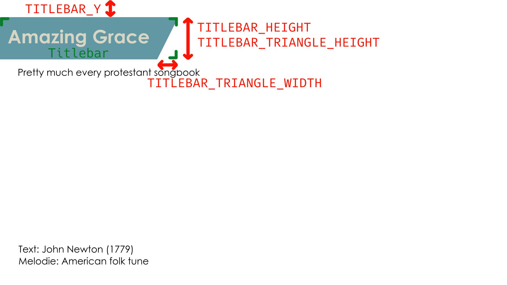

# slidegen

As the name may partially imply, **slidegen** generates song slides as images - out of a plain text input file - intended for use with [OBS]() to livestream a typical (contemporary) Sunday church service.

This program is also intended to be used in conjunction with [ssync](https://github.com/noahvogt/ssync), which is basically a wrapper script that automatically syncs a local copy with the remote slide repository, removes the old obs slides and lets the user interactively choose the new slides with a smart fuzzy finder.

Standalone use of **slidegen** is possible and can sure fit other use cases.

## Why this program exists

To add song slides to OBS or similar software as input sources, there exist the following obvious options:

- generating song slides via a text or presentation documents, exported in printable form and converted to images afterwards
- generating images through image manipulation or designing software and export to images

Both of these processes have *major downsides*: They are hard to automate, take a long time to create the slides, have very limited to support for bulk operations on the song repository (like wanting to change the theme and layout of all slides or changing the metadata shared by a lot of songs) and maintaining is a lot harder because of bad portability and complex source files.

The only upside they have is that can be more intuitive for inexperienced computer users, but changing a text file template and uploading to a remote storage should not be too hard to manage and worth it as it has *none* of the above mentioned downsides.

## Usage

### Commandline Interface
As mentioned above, this program is not made to be executed directly. Therefore the commandline interface is not yet fully stable. Generally, the syntax is as follows

    ./slidegen.py SRC_PATH DEST_DIR PROMPT_INPUT

with `SRC_PATH` being the path to the song plain text file, `DEST_DIR` the output directory where the slide image file output is placed and `PROMPT_INPUT`

Here a short example:

    ./slidegen.py "../songrepo/Stille Nacht.txt" "~/Documents/Song Slides 1"

### Source File Layout

The file is divided into two what we will here call *parts* that are divided with at least one `\n` character and an arbitrary amount of lines that are either empty or only contain whitespace:
- the metadata header (top of the file)
- the text body (bottom of the file)

#### 1. Part: The Metadata Header

As the top of the file are these five metadata entries. We call them *metadata strings*:
- title
- book
- text
- melody
- structure

As for the syntax, each line starts with the metadata string, followed by *": "*, and ends with a non-empty string that acts as the value of the metadata string, which we call *metadata value*.  The `structure` is allowed only `R` and non-negative integers values separated by one comma each, which represents the structure or order in which to song is to be played by dividing the song into refrain and verses. The values in between the commas are called *structure elements*.

Hence to check if a line in the header has the correct syntax use the following regular expression: `^(?!structure)\S+: .+|^structure: ([0-9]+|R)(,([0-9]+|R))*$`. What is not captured syntactically by this regex is that each metadata string and value pair must appear *exactly once* in the header.

The semantics of the other metadata values can be pretty much whatever you want, as long as they adhere to the syntax. Note also that the arrangement of lines doesn't have to match the list above, e.g. the line with the book metadata string can be above the line containing the title metadata, but note that it is probably better to not mix this up anyway for quicker manual editing's sake.

Example of a metadata header:

    title: Amazing Grace
    book: Pretty much every protestant songbook
    text: John Newton (1779)
    melody: American folk tune
    structure: 1,2,3

#### 2. Part: The Text Body

To start off with the syntax, every unique structure element, will be placed on a separate line between an opening square bracket directly to the left and an closing square bracket directly to the right, e.g. `[R]` or `[3]`. We call these lines *structure element identifiers*. After each of those lines must follow a finite amount of lines that semantically carry the song text of the corresponding refrain or verse indicated by the structure element. The lines which are empty or only contain whitespace after the last line that doesn't meet these two requirements before either the next structure element identifier or the end of the file are *ignored*, while the lines that are empty or only contain whitespace before that last line who doesn't meet these two requirements are *not ignored*, as they semantically could act as separators intended by the user. Note that such ignored lines are not syntactically necessary, but are heavily encouraged for their clearer separation they provide semantically.

Here is a example of a text body using the first three verses of *'Amazing Grace'* written by John Newton found on [Hymnary.org](https://hymnary.org/text/amazing_grace_how_sweet_the_sound):

    [1]
    Amazing grace (how sweet the sound)
    that saved a wretch like me!
    I once was lost, but now am found,
    was blind, but now I see.

    [2]
    'Twas grace that taught my heart to fear,
    and grace my fears relieved;
    how precious did that grace appear
    the hour I first believed!

    [3]
    Through many dangers, toils and snares
    I have already come:
    'tis grace has brought me safe thus far,
    and grace will lead me home.

### Configuration

The configuration of `slidegen.py` is handled via constants in `*.py` files. The default configuration is stored in `config/default_config.py`, and in the same form a custom user-defined configuration can optionally be placed in `config/config.py`. You don't have to specify all the constants present in the default config, only the one's you want to change.

For example, if you want to change the text color to green and the file extension the jpeg, your `config/config.py` could look like this:

```python
TEXT_COLOR = "green"
FILE_EXTENSION = "jpeg"
```

Now for explanation of the individual entries.

#### File Format and Naming

`IMAGE_FORMAT` forces a specific file format when writing the files in formats accepted by ImageMagick. The individual slides get named in this form: `${FILE_NAMEING}${SLIDE_NUMBER}${FILE_EXTENSION}`. Hence with the default config of

```python
IMAGE_FORMAT = "jpeg"
FILE_EXTENSION = "jpg"
FILE_NAMEING = "slide-"
```

the slides would be named `slide-1.jpg`, `slide-2.jpg`, `slide-3.jpg` etc.

#### Dimensions

`WIDTH` and `HEIGHT` present the output resolution of the slide in pixels. Meaning for 4K slides you would have to use

```python
WIDTH = 3840
HEIGHT = 2160
```

#### General Colors

Now let us look at the start slide. With `BG_COLOR` we can set the background for all slides and `FG_COLOR` sets the color of the what we call *titlebar*. Note the color values are again in the typical form accepted by ImageMagick.

```python
BG_COLOR = "white"
FG_COLOR = "#6298a4"
```


#### Titlebar

```python
TITLE_COLOR = "#d8d5c4"
MAX_TITLE_FONT_SIZE = 70
MIN_TITLE_FONT_SIZE = 20
TITLE_FONT_SIZE_STEP = 10
TITLE_HEIGHT = 160
TITLEBAR_Y = 65
```

Both `TITLEBAR_Y` and `TITLE_HEIGHT` are transformations given in pixels as shown in the following image. THE `TITLE_COLOR` gives a color of the song title (in this example, *"Amazing Grace"*) in the accepted color format of ImageMagick, same for the font sizes. More in detail, the `MAX_TITLE_FONT_SIZE` is applied when the song title is not too long, but when is the case, slidegen automatically shrinks down the font size in steps of `TITLE_FONT_SIZE_STEP` until it reaches the minimum font size specified by `MIN_TITLE_FONT_SIZE`.



#### Infodisplay

```python
INFODISPLAY_FONT_SIZE = 25
INFODISPLAY_ITEM_WIDTH = 20
INFODISPLAY_X = 1650
INFODISPLAY_Y = 1000
```

`INFODISPLAY_X` and `INFODISPLAY_Y` are the coordinates given as pixels which define where the top-left pixel of the infodisplay is located on the song slides. `INFODISPLAY_FONT_SIZE` just gives the font size in a format acceptable by ImageMagick. Closely related, `INFODISPLAY_ITEM_WIDTH` gives the width in pixels of both the letter of a structure element in the infodisplay and the whitespace that follows before the next structure to the right.


## Roadmap

These are some issues and possible changes that will be addressed or at least considered by our future development efforts:

- prevent all crashes:
    - safe `PROMPT_INPUT` parsing
    - handle possibly incorrect or insensible configurations safely
- integrating [ssync](https://github.com/noahvogt/ssync) into this (and hence a single) repo
- asynchronous slide generation
- use caching, with checksum checks for changes in the source file and the `PROMPT_INPUT`
- provide ssync with the song structure, display it to the user and prevent him from entering a prompt that would slidegen cause to terminate unsuccessfully
- add more optional metadata strings
- use a more typical commandline argument system
- add more documentation, especially explaining the slide generation and its configuration
- better handling of font path Configuration
- add tests

## Licensing

**slidegen** is free (as in “free speech” and also as in “free beer”) Software. It is distributed under the GNU General Public License v3 (or any later version) - see the accompanying LICENSE file for more details.
